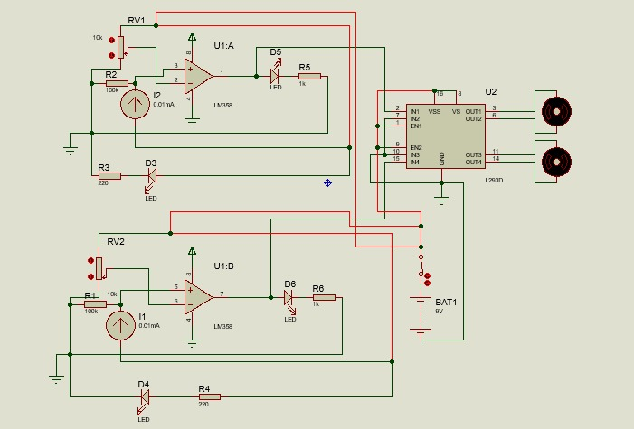
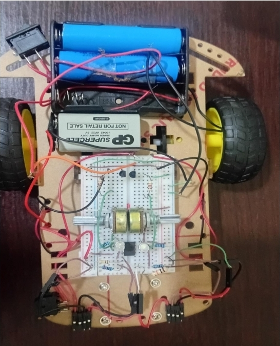

# Line-follower-robot-without-microcontroller
An autonomous line-following robot designed using infrared sensors, LM358 comparators, transistor-based motor control, and DC motors.

# Line Follower Robot

An autonomous line-following robot designed and built as part of an Electrical/Electronics Engineering course project.

## Project Overview

The Line Follower Robot is an autonomous robotic system designed to detect and follow a predefined path, typically a black line on a white surface.

The robot uses infrared sensors to detect changes in the surface. The sensor signals are processed using an LM358 comparator circuit and used to control the motors through transistor-based switching.

The project involved circuit design, Proteus simulation, hardware assembly, sensor calibration, troubleshooting, and testing.

## System Flow

IR Sensors → LM358 Comparator → Transistor Switching → DC Motors → Robot Movement

## Components Used

- IR transmitter and receiver pairs
- LM358 IC
- Transistors
- 10 kΩ variable resistors
- 100 kΩ resistors
- 1 kΩ resistors
- 220 Ω resistors
- LEDs
- BO DC motors
- Wheels
- 18650 Li-ion batteries
- Perfboard
- Connecting wires
- Chassis

## How It Works

The IR sensors detect the difference between the black line and the surrounding surface.

The sensor outputs are fed into the LM358 comparator, which compares the sensor voltage with a reference voltage. The comparator output controls the transistor switching circuit.

The transistors act as electronic switches that control the motors. By changing the operation of the motors based on sensor feedback, the robot is able to correct its direction and remain on the line.

## Circuit Diagram

## Key Features

- Infrared line detection
- Autonomous movement
- Sensor-based direction control
- LM358 comparator circuit
- Transistor-based motor switching
- Adjustable sensor sensitivity
- Real-time feedback control

## Design and Simulation

The circuit was designed and tested using Proteus before hardware implementation.

Simulation was used to verify the circuit operation and identify wiring and motor-control issues before testing the physical prototype.

## Testing

The completed robot was tested on a track consisting of a contrasting line and background surface.

During testing, the sensor sensitivity was adjusted to improve line detection. Motor connections were also checked and corrected to ensure that both wheels rotated in the appropriate direction.

The robot successfully detected the line and followed the predefined path.

## Skills Demonstrated

- Analog Circuit Design
- Proteus Simulation
- Infrared Sensor Interfacing
- Comparator Circuits
- Transistor Switching
- Motor Control
- Circuit Troubleshooting
- Hardware Prototyping
- Robotics and Automation

## Project Documentation

- Project Report
- Circuit diagram
- Proteus simulation
- Hardware prototype
- Demonstration video

## Hardware Prototype

## Project Report

📄 [View Project Report](Line-Follower-Robot%20Report.pdf)

## Project Outcome

The project provided practical experience in designing, simulating, assembling, testing, and troubleshooting an autonomous robotic system.

The completed prototype demonstrated how sensor feedback can be used to control motor movement and achieve autonomous line following.
